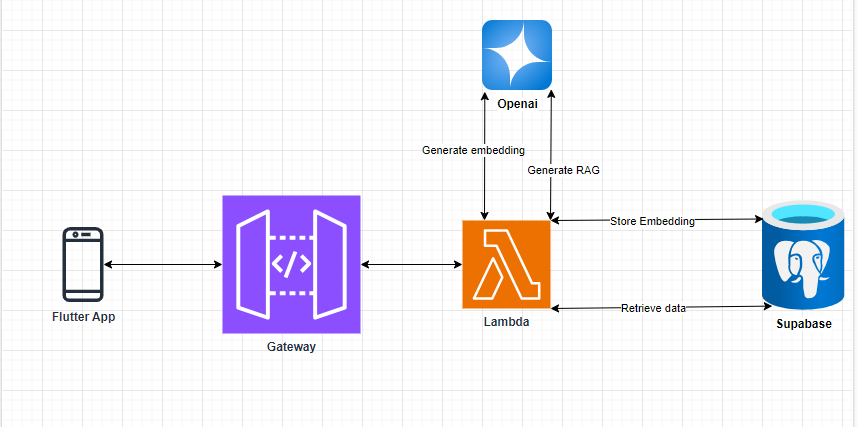

# Serverless RAG Diary



## Configuration

### Environment Variables

Need to set the following environment variables:

```env
SUPABASE_URL=yoursupabaseurl
SUPABASE_KEY=yoursupabasekey
OPENAI_API_KEY=youropenaikey
```

*In my case, I'm using Github secrets to store these values.*

### Terraform

Also need to create an s3 bucket and a DynamoDB table for terraform state.

S3 bucket:
```bash
aws s3api create-bucket --bucket terraform-state-rag-diary --region sa-east-1 --create-bucket-configuration LocationConstraint=sa-east-1
```

Enable versioning for the bucket (optional):
```bash
aws s3api put-bucket-versioning --bucket terraform-state-rag-diary --versioning-configuration Status=Enabled
```

DynamoDB table:
```bash
aws dynamodb create-table \
    --table-name terraform_locks_diary \
    --attribute-definitions AttributeName=LockID,AttributeType=S \
    --key-schema AttributeName=LockID,KeyType=HASH \
    --billing-mode PAY_PER_REQUEST \
    --region sa-east-1
```

### Supabase

I'm using supabase and PgVector to store the diary entries with a column for the OpenAI text embedding.

Need to enable the `pgvector` extension:

```sql
create extension if not exists vector;
```

Create a new table called `diary` with the following columns:

```sql
CREATE TABLE IF NOT EXISTS diary (
    id bigserial PRIMARY KEY,
    title text NOT NULL,
    content text NOT NULL,
    created_at timestamp NOT NULL DEFAULT NOW(),
    embedding vector(3072) NOT NULL -- openai text embedding (large)
);
```

Create a stored procedure called `search_diary`:

```sql
create or replace function search_diary(
    query_embedding vector(3072),
    similarity_threshold float,
    match_count int
)
returns table (
    id bigint,
    title text,
    content text,
    created_at timestamp,
    similarity float
)
language plpgsql
as $$
begin
    return query
    select
        diary.id,
        diary.title,
        diary.content,
        diary.created_at,
        diary.embedding <#> query_embedding as similarity
    from
        diary
    where
        diary.embedding <#> query_embedding < similarity_threshold
    order by
        diary.embedding <#> query_embedding
    limit
        match_count;
end;
$$;
```

That's the store procedure that does the semantic search.

Create a index for the `embedding` column (optional):

```sql
create index on public.diary
using ivfflat (embedding vector_cosine_ops)
with (lists = 100);
```